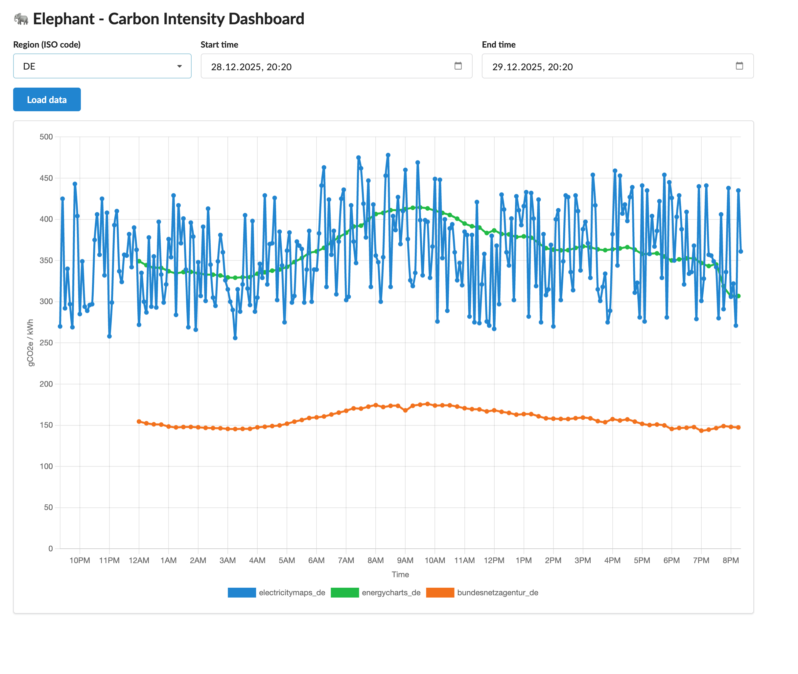

# Elephant 🐘

**Elephant** is a specialized Carbon Grid Intensity (CGI) service. It provides current and historical carbon intensity data from multiple providers.

Its main purpose is the integration into the Green Metrics Tool (GMT) to provide dynamic carbon intensity values.



## Installation

```bash
git clone https://github.com/green-coding-solutions/elephant
cd elephant

# Create virtual environment
python3 -m venv venv
source venv/bin/activate

# Install dependencies
pip install -r requirements.txt
```

## Configuration

Before running Elephant, you need to configure your data providers:

```bash
# Copy the example configuration
cp config.example.yml config.yml
```

Edit `config.yml` and add API tokens per source in `cron.sources` (via `api_token`).
If a source should skip historical fetches, set `only_get_current: true` on that source.
You can also set `resolution` per source to override provider defaults (for example ElectricityMaps `5_minutes`).
Set `update_iterval` (seconds) on a source to run it less frequently than the global cron loop (`run_cron_checker_seconds`).

For ElectricityMaps: Replace "your-electricitymaps-api-token-here" with your actual token. You don't need to modify anything to start collection. We use free endpoints per default.


## Running

You should just be able to do
```bash
docker compose up --build
```

and that should set everythin up so that you can access Elephant under `http://localhost:8085/`

**Required for ElectricityMaps:**

- Sign up at [ElectricityMaps](https://portal.electricitymaps.com/) to get an API token
- Add a `cron.sources` entry with `provider: "electricitymaps"` and set its `api_token`

## Development
You should be able to

```
pip install -r requirements-dev.txt
pylint --recursive=y elephant/
pytest tests
```

Also for development it might be easier to not having to build a docker container all the time. So you can only run the DB with

```bash
docker compose up -d db
```

and then run the commands on your development machine

```bash
python3 -m elephant.database
python3 -m elephant.cron
python3 -m elephant --host 0.0.0.0 --port 8085
```

## API

Once Elephant is running (for example with `docker compose up --build`), the generated docs are available at:

- Swagger UI: `http://localhost:8085/docs`
- ReDoc: `http://localhost:8085/redoc`

### Core endpoints

- `GET /carbon-intensity/current` — Latest carbon intensities for a region. Query params: `region` (ISO 3166-1 alpha-2), optional `update` (force refresh) and `simulation_id` (serve simulated data).
- `GET /carbon-intensity/current/primary` — Latest carbon intensity from the configured primary provider for `region`; also accepts `update` and `simulation_id`.
- `GET /carbon-intensity/history` — Historical values between `startTime` and `endTime` (ISO 8601) for `region`.
- `GET /regions` — List of regions with stored data.
- `GET /health` — Service health, providers, DB record count, and regions.

### Simulation endpoints

Elephant includes a lightweight simulator so you can drive client integrations or demos without live provider data.

- `POST /simulation` with a JSON body `{"carbon_values": [120, [140, 2], [100, null]]}` registers a run and returns a `simulation_id`. Each entry is either a float or a `[value, calls]` pair; `calls` is how often that value is returned before automatically advancing (use `null` to disable auto-advance).
- `GET /simulation/get_carbon?simulation_id=...` returns the current simulated carbon intensity and will auto-advance when call thresholds are met.
- `POST /simulation/next?simulation_id=...` forces the next value.
- `GET /simulation/stats?simulation_id=...` shows the current index and call history for debugging.

You can plug a simulation into the core responses by passing `simulation_id`:

```bash
curl "http://localhost:8085/carbon-intensity/current?region=DE&simulation_id=<simulation_id>"
curl "http://localhost:8085/carbon-intensity/current/primary?region=DE&simulation_id=<simulation_id>"
```

### Electricity Maps compatible endpoints

For Electricity Maps compatible payloads, use the v3 endpoints:

```bash
curl "http://localhost:8085/v3/carbon-intensity/current?zone=DE"
curl "http://localhost:8085/v3/carbon-intensity/history?zone=DE"
```

They mirror the Electricity Maps API schema. To serve simulated data to an Electricity Maps client, send the simulation id as `auth-token`:

```bash
curl -H "auth-token: <simulation_id>" "http://localhost:8085/v3/carbon-intensity/current?zone=DE"
curl -H "auth-token: <simulation_id>" "http://localhost:8085/v3/carbon-intensity/history?zone=DE"
```


## Credit / Funding

This work is funded by the Deutsche Bundesstiftung Umwelt (DBU) under the number [DBU Project 39703/01](https://www.dbu.de/projektdatenbank/39703-01/)

Project details are to be found on the [project page](https://greencoding.f2.htw-berlin.de/projekte/caso-entwicklung-von-technologien-zur-co2-und-energieeinsparung-bei-der-softwareentwicklung/)


We are super grateful for this funding and are blessed to have been granted the opportunity to create this data repository for the greater
software community!
